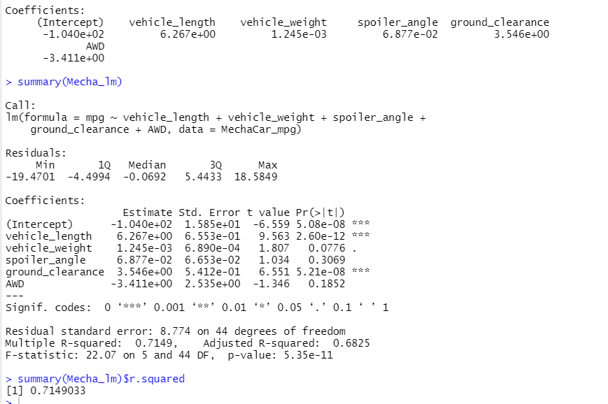
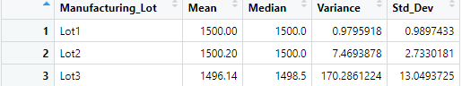

# MechaCar_Statistical_Analysis

## Linear Regression to Predict MPG

Which variables/coefficients provided a non-random amount of variance to the mpg values in the dataset?

- Ground_clearance and vehcile_length are statistically unlikley to provide a random amounts of variance to the mpg values in the dadtaset. 

Is the slope of the linear model considered to be zero? Why or why not?

- As you can see above the Pr(>|t|) of the intercept is not 0 and is statistically significant (less than .05).  This means the intercept term explains a significant amount of variability in the dependent variable when all independent vairables are equal to zero.

Does this linear model predict mpg of MechaCar prototypes effectively? Why or why not?

- As you can see above, the multiple R-squared value is .71 (> .7 equates to a strong correlation).  This indicates that the linear model predicts mpg of MechaCar Prototypes effectively.

## Summary Statistics on Suspension Coils

Total Summary

Lot Summary 

The design specifications for the MechaCar suspension coils dictate that the variance of the suspension coils must not exceed 100 pounds per square inch. Does the current manufacturing data meet this design specification for all manufacturing lots in total and each lot individually? Why or why not?

- In total, the variance of the suspension coils is 62.29 which is less than the 100 PSI specification.

- Lots 1 and 2 are within the speicification. However, Lot 3 is well above the 100 PSI specification. 

## T-Tests on Suspension Coils

- As you can see above, with a p-value of .06, all of the lots are not significantly different from the population mean.

- With a p-value of 1, Lot 1 is not significantly different from the population mean.

- With a p-value of .607, Lot 2 is not significantly different from the population mean.

- With a p-value of .041, Lot 3 is  significantly different from the population mean.

## Study Design: MechaCar vs Competition

A potential study to show the 

The null hypotheis would be there is no statistifal diffence with the alt is there is a sign diff. 

